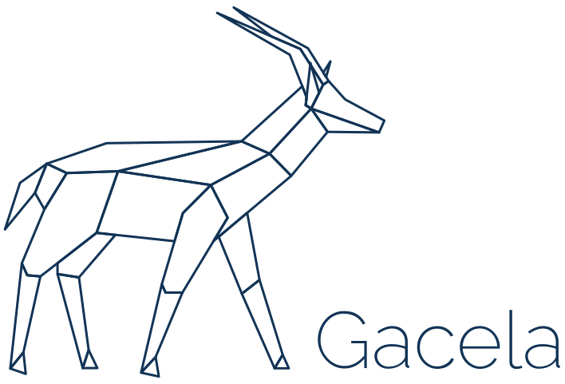

# Gacela Project Website



This website uses zola.

## Instructions

You must run the following command the first time in order to pull the web theme
```
git submodule update --init --recursive
```

Run `zola serve` to run it locally.
